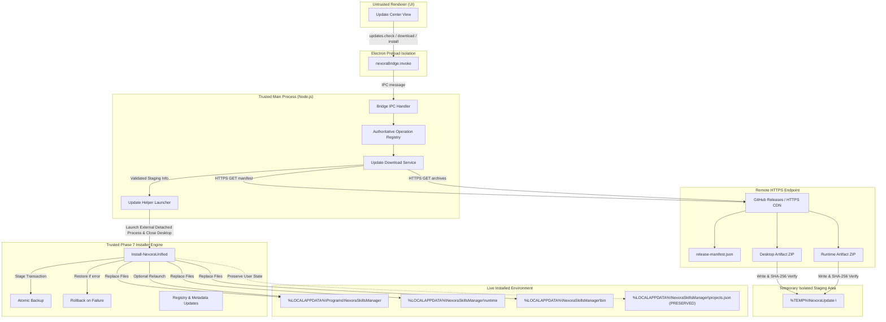

# Nexora Skills Manager — Remote Update Architecture (Phase 8.1)

## 1. Executive Summary & Core Objective
The remote update subsystem provides a secure, deterministic, and non-destructive update mechanism for Nexora Skills Manager across both the Desktop application and the shared PowerShell runtime.

### Guiding Principles & Invariants:
1. **Reuse Phase 7 Installer Lifecycle**: The remote update system downloads and validates release artifacts; it **never** writes directly into production installation paths. All disk mutations, backups, file replacements, rollback, and verification are delegated to the proven Phase 7 transactional installer engine (`Install-NexoraUnified`).
2. **Single Shared Runtime**: Updating the product updates the shared runtime (`%LOCALAPPDATA%\NexoraSkillsManager\runtime`) and Desktop application (`%LOCALAPPDATA%\Programs\NexoraSkillsManager`), ensuring both CLI (`nexora`) and Desktop UI execute the identical version.
3. **Strict Step Separation**: `CHECK != DOWNLOAD != INSTALL`. Checking never downloads archives; downloading never installs automatically; installation requires explicit user confirmation.
4. **No Silent Reboots / No Silent Updates**: Updates are never silently installed in the background without explicit user intent.
5. **Zero Trust for Renderer**: The UI/renderer process has zero access to network sockets, file pickers, arbitrary URLs, or direct PowerShell execution.

---

## 2. High-Level System Architecture Diagram

---

## 3. Component Responsibilities & Boundaries

| Component | Responsibility | Constraints |
| :--- | :--- | :--- |
| **Renderer (UI)** | Renders Update Center view, presents version metrics, requests update check/download/install, receives progress events. | No Node integration, no direct network access, no execution privileges. |
| **Preload Bridge** | Exposes frozen `window.nexoraBridge.invoke` methods and event listeners. | Sanitizes arguments, validates against allowed operations. |
| **Main IPC Handler** | Validates requests against operation registry and enforces single-transaction locking. | Dispatches to trusted backend services. |
| **Node.js Update Service** | Manages HTTPS transport for manifest and artifacts, enforces timeouts/redirects, computes SHA-256 checksums, and manages staging. | Uses Node native `https` / streaming crypto; confines writes to `%TEMP%`. |
| **PowerShell Worker** | Houses `UpdateService.ps1` / `NexoraApplicationService.ps1` for local status, installed version queries, and diagnostic integration. | Communicates via line-buffered JSON stdio. |
| **Update Helper Process** | Detached lightweight helper invoked when installing updates while Desktop is running. | Waits for parent Desktop process to exit, executes Phase 7 installer, relaunches app. |
| **Phase 7 Installer** | Executes transactional install, creates backup, applies payload, verifies health, rolls back on failure. | Sole component authorized to modify production directories. |

---

## 4. Networking Architecture & Implementation Decision

### Evaluated Options:
1. **Option A: PowerShell-based Downloads (`Invoke-WebRequest` / `HttpClient` in worker)**
   - *Drawbacks*: Windows PowerShell 5.1 TLS 1.2 handling quirks, line-buffered stdio blocking during large file streaming, complex progress event tunneling from PowerShell to Node to Renderer.
2. **Option B: Node.js Main-Process Networking (Recommended)**
   - *Advantages*: Native HTTPS streaming, non-blocking asynchronous event loop, built-in Node `crypto` streaming SHA-256 hashing, fine-grained redirect handling, native progress event streaming, zero worker stdio contention, excellent mockability for offline unit tests.

### Decision:
**Node.js Main-Process Networking** in `desktop/updates/` handles remote HTTPS manifest retrieval and artifact downloading. The PowerShell application service (`engine/Updates/`) maintains canonical local version resolution, state reflection, and Phase 7 installer execution.

---

## 5. Running Desktop Update & Process In-Use Lifecycle

Because the Desktop application is actively running when the user clicks **Install Update**, the update handoff must solve the "file-in-use" lock on `NexoraSkillsManager.exe` and `resources/app.asar`.

### Handoff Protocol:
1. **Verification Complete**: All release artifacts downloaded into `%TEMP%\NexoraUpdate-<GUID>\` and verified against manifest SHA-256 and size.
2. **Handoff Preparation**: Node main process writes `update-handoff.json` containing:
   - `manifestPath`
   - `desktopZipPath`
   - `runtimeZipPath`
   - `parentPid` (Desktop process ID)
   - `relaunchAfterInstall` (boolean)
3. **Helper Spawn**: Desktop spawns detached helper `powershell.exe -NoProfile -ExecutionPolicy Bypass -File <installedRuntime>\engine\Install\NexoraUpdateHelper.ps1 -HandoffFile <path>`.
4. **Desktop Exit**: Desktop process terminates cleanly (`app.quit()`), releasing all file locks.
5. **Helper Execution**:
   - Helper waits for `parentPid` to terminate (up to 15s).
   - Helper calls `Install-NexoraUnified` targeting live install locations.
   - On success: Launches newly installed `NexoraSkillsManager.exe` (if requested) and cleans staging directory.
   - On failure: Phase 7 installer automatically rolls back to previous backup; helper logs error to `%LOCALAPPDATA%\NexoraSkillsManager\logs\updates.log`.

---

## 6. Offline & Failure Recovery Architecture

- **Offline Mode**: When no internet connection is available, update check returns `{ success: false, error: { code: 'UPDATE_OFFLINE' }, currentVersion: '1.0.0', checkedRemotely: false }`. All local features remain 100% operational.
- **Interrupted Download**: Partial downloads are deleted on cancellation or error. No partial files remain in staging.
- **Crash Prior to Install**: If the application crashes after download but before install, the temporary staging folder is cleaned on next startup. No corruption occurs.
- **Installer Failure**: If the update installation fails, Phase 7 transactional rollback restores the previous Desktop and Runtime installation byte-for-byte.
