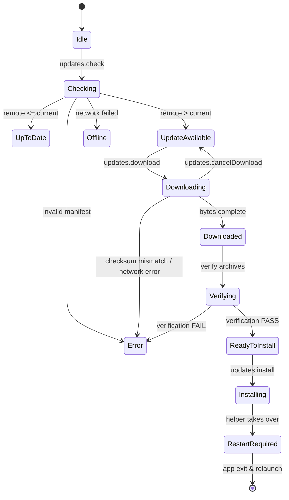

# Nexora Skills Manager — Remote Update IPC Contract (Phase 8.1)

## 1. Bridge Protocol Expansion Model

The frozen Phase 6.2 bridge contract included 25 operations, concluding with `updates.status` (a local-only status query).
Phase 8 expands the bridge registry with 4 dedicated, narrow update operations, bringing the authoritative registry count from **25 to 29 operations**.

### Proposed Bridge Operation Set (Operations 26–29):
1. `updates.status` (Op 25 — preserved backward compatible)
2. `updates.check` (Op 26 — remote release query)
3. `updates.download` (Op 27 — asynchronous artifact download)
4. `updates.cancelDownload` (Op 28 — cancel active download)
5. `updates.install` (Op 29 — initiate validated installer handoff)

---

## 2. Structured Request / Response Envelopes

### A. `updates.status` (Local Status Query)
- **Timeout Class**: `FAST_READ` (5,000 ms)
- **Is Mutating**: `false`
- **Request Payload**: `{}`
- **Response Data**:
  ```json
  {
    "currentVersion": "1.0.0",
    "latestVersion": null,
    "updateAvailable": null,
    "checkedRemotely": false,
    "channel": "stable",
    "status": "Local installation verified",
    "message": "Local v1.0.0 verified. Remote update checks not performed.",
    "checkedAt": "2026-08-22T12:00:00.000Z"
  }
  ```

### B. `updates.check` (Remote Version Check)
- **Timeout Class**: `STANDARD_LOCAL` (10,000 ms)
- **Is Mutating**: `false`
- **Request Payload**: `{ channel?: "stable" | "beta" }`
- **Response Data (Update Available)**:
  ```json
  {
    "currentVersion": "1.0.0",
    "latestVersion": "1.0.1",
    "updateAvailable": true,
    "channel": "stable",
    "checkedRemotely": true,
    "publishedAt": "2026-08-22T12:00:00.000Z",
    "releaseNotesUrl": "https://github.com/abhishek01032007-pixel/Nexora-Skills-Manager/releases/tag/v1.0.1",
    "downloadSize": 112018298,
    "checkedAt": "2026-08-22T12:00:05.000Z"
  }
  ```
- **Response Data (Offline / Network Error)**:
  ```json
  {
    "success": false,
    "error": {
      "code": "UPDATE_OFFLINE",
      "message": "Unable to connect to update server. Working offline.",
      "retryable": true
    },
    "currentVersion": "1.0.0",
    "checkedRemotely": false
  }
  ```

### C. `updates.download` (Download Release Artifacts)
- **Timeout Class**: `SKILL_MUTATION` (60,000 ms per stage)
- **Is Mutating**: `true`
- **Request Payload**: `{ version: "1.0.1" }`
- **Response Data**:
  ```json
  {
    "success": true,
    "version": "1.0.1",
    "stagedPath": "C:\\Users\\user\\AppData\\Local\\Temp\\NexoraUpdate-a1b2c3d4",
    "desktopVerified": true,
    "runtimeVerified": true,
    "totalBytes": 112018298,
    "readyToInstall": true
  }
  ```

### D. `updates.cancelDownload` (Cancel Active Download)
- **Timeout Class**: `FAST_READ` (5,000 ms)
- **Is Mutating**: `true`
- **Request Payload**: `{}`
- **Response Data**:
  ```json
  {
    "success": true,
    "cancelled": true,
    "message": "Download cancelled and temporary staging deleted."
  }
  ```

### E. `updates.install` (Trigger Transactional Installer Handoff)
- **Timeout Class**: `STANDARD_LOCAL` (10,000 ms to spawn helper and acknowledge)
- **Is Mutating**: `true`
- **Request Payload**: `{ version: "1.0.1", relaunchAfterInstall?: true }`
- **Response Data**:
  ```json
  {
    "success": true,
    "status": "installing",
    "message": "Update helper launched. Application will now exit to complete installation."
  }
  ```

---

## 3. Asynchronous Progress Event Contract

During `updates.download`, progress updates are sent from the Main process to the Renderer via a dedicated read-only IPC channel `nexora:update-progress`.

```json
{
  "operation": "download",
  "version": "1.0.1",
  "artifact": "desktop",
  "bytesReceived": 54201824,
  "totalBytes": 111241430,
  "percent": 48.7,
  "speedBytesPerSec": 2500000
}
```

---

## 4. State Machine & Transition Rules



---

## 5. Stable Update Error Codes

| Error Code | Description | User Presentation |
| :--- | :--- | :--- |
| `UPDATE_OFFLINE` | No internet connection or DNS failure | "Offline — Check your internet connection." |
| `UPDATE_TIMEOUT` | Remote server did not respond within timeout window | "Update check timed out. Please try again." |
| `UPDATE_REMOTE_ERROR` | HTTP 4xx/5xx status code from remote server | "Update server error. Please try again later." |
| `UPDATE_MANIFEST_INVALID` | Manifest is not valid JSON or missing required fields | "Invalid release metadata received." |
| `UPDATE_MANIFEST_UNSUPPORTED` | Manifest `schemaVersion` is higher than supported | "Client update required to read this release." |
| `UPDATE_VERSION_INVALID` | Remote version string is not valid SemVer | "Invalid release version received." |
| `UPDATE_NO_UPDATE` | System is already on the latest available version | "Nexora is up to date." |
| `UPDATE_DOWNLOAD_FAILED` | Network failure during artifact streaming | "Download failed. Please try again." |
| `UPDATE_DOWNLOAD_CANCELLED` | User requested cancellation | "Download cancelled." |
| `UPDATE_ARTIFACT_SIZE_MISMATCH` | Downloaded byte length does not match manifest | "Downloaded file size mismatch." |
| `UPDATE_CHECKSUM_MISMATCH` | Computed SHA-256 does not match manifest | "Security verification failed: Checksum mismatch." |
| `UPDATE_ARTIFACT_INVALID` | Archive contents missing required components | "Corrupt release archive." |
| `UPDATE_INSTALL_FAILED` | Transactional installer failed during replacement | "Installation failed. Previous version restored." |
| `UPDATE_CLIENT_TOO_OLD` | Installed version is below `minimumSupportedVersion` | "Direct upgrade not supported. Please reinstall." |
| `UPDATE_OPERATION_IN_PROGRESS` | Another update mutation is already active | "Update operation already in progress." |
